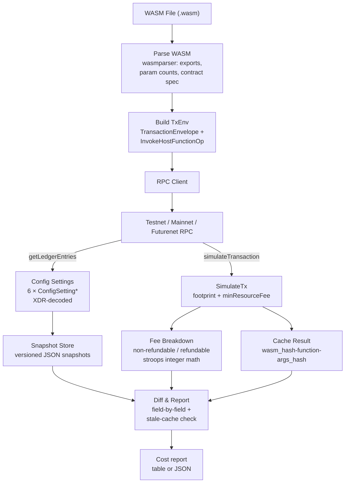

# Architecture

This document describes the internal structure, data flow, and design
decisions of `soroban-cost-estimator` for contributors. It assumes familiarity
with [Soroban](https://soroban.stellar.org/) and the
[Stellar RPC](https://soroban-docs.stellar.org/api/) interface.

## Overview

`soroban-cost-estimator` is a single-binary CLI tool that estimates the
resource cost of running a Soroban smart contract on the Stellar network.
It works by:

1. Parsing a compiled `.wasm` file to discover exported functions.
2. Simulating the contract invocation via the Stellar `simulateTransaction`
   RPC endpoint.
3. Breaking down the returned fee into non-refundable and refundable portions
   using the network's own config-sourced rates.
4. Tracking how the network's resource-pricing configuration changes over
   time through versioned JSON snapshots.

The tool supports three Stellar networks out of the box (`testnet`,
`mainnet`, `futurenet`) and accepts a custom RPC URL via `--rpc-url`.

## High-Level Pipeline

Every `estimate` call follows a five-stage pipeline. The WASM-parsing,
fee-breakdown, and config-snapshot stages are pure computation; the
RPC-simulation stage is the only one that talks to the network.



## Directory Layout

```
src/
├── main.rs               # CLI entry point, command dispatch, top-level orchestration
├── lib.rs                # Crate root — re-exports public modules
├── cli.rs                # clap-based CLI definition (Command, ConfigAction, CacheAction)
├── error.rs              # Unified error type (AppError) and AppResult alias
├── cache.rs              # Estimate caching (~/.soroban-cost-estimator/cache/)
├── xdr_helper.rs         # XDR encode/decode, tx-envelope construction, arg parsing
├── bin/
│   └── gen_test_wasm.rs  # Utility binary: generates minimal test WASM fixtures
├── rpc/
│   ├── mod.rs            # Module re-exports
│   ├── client.rs         # JSON-RPC 2.0 client, network-to-URL resolution
│   ├── simulate.rs       # simulateTransaction call + response parsing
│   └── config.rs         # getLedgerEntries for ConfigSetting* entries
├── wasm/
│   ├── mod.rs            # Module re-exports
│   └── parser.rs         # WASM loading, validation, function enumeration, contract spec decoding
├── report/
│   ├── mod.rs            # Module re-exports
│   ├── cost_report.rs    # CostReport struct and basic formatters
│   ├── fee_calc.rs       # FeeBreakdown, FeeRates, integer stroops math
│   └── formatter.rs      # ReportFormatter trait + Table/JSON/CSV/Markdown impls
├── config_snapshot/
│   ├── mod.rs            # Module re-exports
│   ├── model.rs          # ConfigSnapshot and per-setting structs (6 settings)
│   ├── diff.rs           # Field-by-field snapshot comparison, pricing-change detection
│   ├── store.rs          # Snapshot persistence (~/.soroban-cost-estimator/snapshots/)
│   └── history.rs        # Chronological change log, last-changed tracking
tests/
├── cli_tests.rs          # CLI integration tests
├── parser_tests.rs       # WASM parser tests
├── fee_calc_tests.rs     # Fee calculation unit tests
├── cache_tests.rs        # Cache round-trip tests
├── report_snapshots.rs   # insta snapshot tests for all formatters
├── fixtures/             # Test WASM binaries and contract sources
└── snapshots/            # insta snapshot files
benches/
└── wasm_parse.rs         # Criterion benchmarks for WASM parsing
docs/                     # This documentation (mdBook-style)
```

## Module Details

### `cli.rs` — Command Definition

Uses `clap` derive macros to define the CLI surface. The top-level `Cli`
struct contains a `Command` enum with five subcommands:

| Subcommand | Purpose |
|---|---|
| `estimate` | Simulate a single contract invocation and print the cost report |
| `estimate-all` | Enumerate all exported functions and estimate each one |
| `config snapshot` | Fetch and store a snapshot of network pricing configuration |
| `config diff` | Compare current config against a stored snapshot |
| `config history` | Show the full chronological change log |
| `config last-changed` | Show when each setting last changed |
| `watch` | Poll network config on an interval and print diffs |
| `cache verify` | Check every cache entry for corruption |

`main.rs` parses the CLI args, then dispatches to `cmd_estimate`,
`cmd_estimate_all`, `cmd_config_snapshot`, `cmd_config_diff`,
`cmd_config_history`, `cmd_config_last_changed`, `cmd_watch`, or
`cmd_cache_verify`.

### `error.rs` — Error Handling

A single `AppError` enum (via `thiserror`) covers every fallible operation:
I/O, RPC, XDR decode/encode, WASM parsing, snapshot management, simulation,
fee calculation, serialization, and general errors. All functions return
`AppResult<T>` (`Result<T, AppError>`). No `unwrap()` or `expect()` is
permitted outside tests.

The `#[from]` attribute on several variants enables the `?` operator for
automatic conversion from `std::io::Error`, `reqwest::Error`, and
`serde_json::Error`.

### `rpc/client.rs` — JSON-RPC Client

`RpcClient` is a thin async wrapper around `reqwest::Client` that sends
JSON-RPC 2.0 requests to a Stellar Soroban RPC endpoint. The `call` method:

1. Builds a JSON-RPC 2.0 request body with `method` and `params`.
2. Sends an HTTP POST to the configured URL.
3. Deserializes the `result` field into the caller's type `T`.
4. Returns `AppError::Rpc` for JSON-RPC errors and `AppError::Http` for
   transport errors.

`resolve_endpoint` maps a network name (`"testnet"`, `"mainnet"`,
`"futurenet"`) to a well-known URL. A custom `--rpc-url` overrides this
resolution.

### `rpc/simulate.rs` — Simulation

`simulate_transaction` sends a `simulateTransaction` RPC call with a
base64-encoded `TransactionEnvelope` XDR. The response struct
`SimulateTransactionResponse` uses `#[serde(rename_all = "camelCase")]` to
match the Soroban RPC's JSON serialization — without this, every field would
silently deserialize as `None`, producing all-zero cost reports.

Two resource fee extraction paths are supported:

- **Modern RPC**: `minResourceFee` is a plain decimal string of stroops, and
  resource usage lives inside `transactionData` XDR
  (`SorobanTransactionData.resources`).
- **Legacy RPC**: `minResourceFee` is a base64-encoded XDR int64, and
  resource usage is in a `cost` object (`cpuInsns`/`memBytes`).

Both paths are handled transparently by `parse_resource_fee` and
`parse_transaction_data_resources`.

### `rpc/config.rs` — Config Settings

`ConfigSettingId` is an enum of the six Soroban config settings:

| Enum Variant | On-chain Name | Key Purpose |
|---|---|---|
| `ContractComputeV0` | `CONFIG_SETTING_CONTRACT_COMPUTE_V0` | CPU instruction fee rates and limits |
| `ContractLedgerCostV0` | `CONFIG_SETTING_CONTRACT_LEDGER_COST_V0` | Ledger entry read/write fees and limits |
| `ContractHistoricalDataV0` | `CONFIG_SETTING_CONTRACT_HISTORICAL_DATA_V0` | Historical data (upload) fee |
| `ContractEventsV0` | `CONFIG_SETTING_CONTRACT_EVENTS_V0` | Contract event fees |
| `ContractBandwidthV0` | `CONFIG_SETTING_CONTRACT_BANDWIDTH_V0` | Transaction size bandwidth fee |
| `StateArchival` | `CONFIG_SETTING_STATE_ARCHIVAL` | State archival TTL and rent rates |

Each variant provides `ledger_key_b64()` which constructs the XDR
`LedgerKey::ConfigSetting` and encodes it to base64. `fetch_all_config_settings`
sends all 6 keys in a single batched `getLedgerEntries` RPC call, then matches
returned entries back by re-encoding keys and comparing against the response's
`key` field.

### `wasm/parser.rs` — WASM Parsing

`load_wasm` reads a `.wasm` file from disk and performs three steps:

1. **Validation**: `wasmparser::validate` checks structural correctness.
2. **Function enumeration**: Walks the WASM type, function, and export
   sections to build a `Vec<FunctionInfo>` with name, param count, and
   result count for each exported function.
3. **Contract spec decoding**: Looks for a `contractspecv0` custom section
   and decodes `ScSpecEntry::FunctionV0` XDR entries to extract typed
   parameter lists (name + type name) that the bare WASM export section
   cannot express.

The `WasmInfo` struct carries the raw bytes, the function list, and a
`has_spec` flag. The SHA-256 of the WASM bytes serves as the identity key
for caching.

### `xdr_helper.rs` — XDR and Transaction Construction

Key responsibilities:

- **`decode_config_entry_xdr`**: Decodes a base64 `LedgerEntryData` XDR
  and extracts the `ConfigSettingEntry` variant.
- **`begin_snapshot` / `apply_config_entry`**: Builds a `ConfigSnapshot` by
  applying each decoded config entry into the appropriate struct field.
- **`build_simulation_tx_envelope`**: Constructs a minimal
  `TransactionEnvelope` for simulation. When `function_name` is `None`, it
  builds a WASM upload operation; when `Some`, it builds an
  `InvokeContract` operation. Returns **raw XDR bytes** (not base64) so
  callers can compute the bandwidth fee from the actual transaction size.
- **`parse_contract_id`**: Accepts both 64-hex and `C…` strkey (SEP-23)
  contract ID formats.
- **`parse_arg_scval`**: Type-infers `--arg` values into `ScVal`: `true`/`false`
  → `Bool`, integers → `I64`/`U64`, everything else → `String`.

### `report/fee_calc.rs` — Fee Breakdown

`FeeBreakdown` is the core output of the fee calculation:

```rust
pub struct FeeBreakdown {
    pub non_refundable_stroops: i64,  // CPU + storage I/O + bandwidth
    pub refundable_stroops: i64,      // events + rent bumps (remainder)
    pub total_stroops: i64,           // authoritative total from simulation
    pub total_xlm: String,           // human-readable (string avoids float)
}
```

`FeeRates` holds the raw config-sourced rates (stroops per 10K instructions,
per ledger entry, per 1KB). `compute_fee_breakdown` derives the
non-refundable portion independently using `(units × rate) / scale` integer
math:

- CPU fee: `(cpu_insns × fee_per_10k_insns) / 10_000`
- Read entry fee: `read_entries × fee_per_read_entry`
- Write entry fee: `write_entries × fee_per_write_entry`
- Read bytes fee: `(read_bytes × fee_per_read_1kb) / 1024`
- Bandwidth fee: `(tx_size × fee_per_1kb) / 1024`

The refundable portion is `max(0, total - non_refundable)`. It floors at 0
to avoid impossible negative values when the simulation omits the fee
entirely.

### `report/formatter.rs` — Output Formats

The `ReportFormatter` trait provides a `format(&CostReport) -> String`
method. Four implementations exist:

| Formatter | Description |
|---|---|
| `TableFormatter` | Human-readable `comfy-table` with fee breakdown (default) |
| `JsonFormatter` | Pretty-printed JSON via `serde_json` |
| `CsvFormatter` | RFC 4180-compliant CSV with 15 fields |
| `MarkdownFormatter` | GitHub-flavored Markdown with resource and fee tables |

`formatter_by_name` provides a lookup from format name to formatter instance.

### `config_snapshot/model.rs` — Snapshot Data Model

`ConfigSnapshot` mirrors the six on-chain `ConfigSetting*` entries:

```rust
pub struct ConfigSnapshot {
    pub network: String,
    pub timestamp: String,      // ISO-8601
    pub ledger: u32,            // last modified ledger
    pub contract_compute: Option<ContractComputeV0>,
    pub contract_ledger_cost: Option<ContractLedgerCostV0>,
    pub contract_historical_data: Option<ContractHistoricalDataV0>,
    pub contract_events: Option<ContractEventsV0>,
    pub contract_bandwidth: Option<ContractBandwidthV0>,
    pub state_archival: Option<StateArchivalV0>,
}
```

Each sub-struct mirrors the corresponding `stellar_xdr` type but uses
JSON-serializable Rust types instead of XDR types.

### `config_snapshot/diff.rs` — Snapshot Comparison

`diff_snapshots` compares two `ConfigSnapshot` instances field by field.
Each changed field produces a `FieldDiff` tagged with:

- `field_path` — dotted path like `contract_compute.fee_rate_per_instructions_increment`
- `old_value` / `new_value` — string representations
- `is_pricing_change` — `true` for fee-rate fields, `false` for limits

`ConfigDiff.has_pricing_changes` is the aggregate flag. When true, the
`config diff` command prints a warning and exits with code 1. The `format_diff`
function renders changes with `💰` for pricing and `📋` for non-pricing changes.

### `config_snapshot/store.rs` — Snapshot Persistence

Snapshots are stored as JSON files under `~/.soroban-cost-estimator/snapshots/`.
The filename format is `{network}-{timestamp}.json` where the timestamp is
ISO-8601 with colons replaced by hyphens.

`load_latest_snapshot` scans the directory for files matching the network
prefix and returns the one with the latest filename (which sorts
chronologically). `list_snapshots` returns all snapshot paths for a network.

### `config_snapshot/history.rs` — Change Tracking

`build_change_log_from_snapshots` takes a set of snapshots, sorts them by
timestamp, and diffs each consecutive pair. Each changed field produces a
`FieldHistoryEntry` stamped with the newer snapshot's timestamp and ledger.

`last_changed_from_log` reduces the log to the single most recent entry per
field — useful for "when did X last change?" queries. Both functions power
the `config history` and `config last-changed` commands.

### `cache.rs` — Estimate Caching

Cached estimates are stored in `~/.soroban-cost-estimator/cache/`. The
filename key is `{wasm_hash}-{function_name}-{args_hash}.json`. Each entry
stores:

- `wasm_hash` — SHA-256 hex of the WASM bytes
- `function` — function name
- `args_hash` — SHA-256 hex of the concatenated arg strings
- `network`, `ledger`, `total_stroops`, `cpu_instructions`, `memory_bytes`
- `timestamp` — ISO-8601 of when the estimate was made

`find_stale_estimates` filters cached entries by ledger — any entry simulated
at an earlier ledger than the current config snapshot is considered stale.
`config diff` cross-references the cache to report which past estimates are
now unreliable.

`verify_cache` reads every `.json` file in the cache directory and checks
that it parses as a valid `CachedEstimate`. Corrupt entries are reported by
filename, and the command exits with code 1 if any fail.

## Data Flow: `estimate` Command

```
User invokes: soroban-cost-estimator estimate --wasm contract.wasm --fn increment --arg step=5

1. Load & validate WASM          (wasm::parser::load_wasm)
   ├─ wasmparser::validate
   ├─ enumerate exported functions
   └─ decode contractspecv0 (if present)

2. Resolve RPC endpoint          (rpc::client::resolve_endpoint)
   "testnet" → "https://soroban-testnet.stellar.org"

3. Parse arguments               (xdr_helper::parse_arg_scval)
   "step=5" → ScVal::I64(5)

4. Build simulation tx envelope  (xdr_helper::build_simulation_tx_envelope)
   └─ TransactionEnvelope → InvokeHostFunctionOp → InvokeContract

5. Simulate against network      (rpc::simulate::simulate_transaction)
   └─ POST / {"method": "simulateTransaction", "params": {...}}

6. Extract resources from response
   ├─ CPU insns from transactionData XDR (modern) or cost object (legacy)
   ├─ Read/write entries from footprint
   └─ Total fee from minResourceFee or transactionData.resource_fee

7. Fetch fee rates               (main::fetch_fee_rates)
   ├─ GET ConfigSettingContractComputeV0     → fee_per_10k_insns
   ├─ GET ConfigSettingContractLedgerCostV0  → fee_per_read_entry, fee_per_write_entry, fee_per_read_1kb
   └─ GET ConfigSettingContractBandwidthV0   → fee_per_1kb

8. Compute fee breakdown         (report::fee_calc::compute_fee_breakdown)
   ├─ Non-refundable = CPU + storage I/O + bandwidth (integer math)
   └─ Refundable = max(0, total - non_refundable)

9. Build CostReport              (report::cost_report::CostReport)

10. Save to cache                (cache::save_estimate)

11. Format & print               (report::formatter::TableFormatter or JsonFormatter)
```

## Data Flow: `config diff` Command

```
1. Load latest snapshot for network   (config_snapshot::store::load_latest_snapshot)
2. Fetch current config from network  (rpc::config::fetch_all_config_settings → xdr_helper::apply_config_entry)
3. Diff snapshots                     (config_snapshot::diff::diff_snapshots)
   └─ field-by-field comparison, pricing-change tagging
4. Format diff output                 (config_snapshot::diff::format_diff)
5. Auto-save post-upgrade snapshot    (if pricing changes detected)
6. Check stale cached estimates       (cache::find_stale_estimates)
7. Exit code 1 if pricing changes     (signals CI/script awareness)
```

## Design Decisions

### No Floating Point

Fee math uses integer stroops math exclusively. The `stroops_to_xlm` and
`xlm_to_stroops` conversions use string formatting with zero-padded
fractional parts. This avoids rounding inconsistencies that floating point
would introduce in financial calculations.

### Non-Refundable Fee Is Not Clamped

The non-refundable fee is derived independently from the network's
config-sourced rates — it is **not** clamped to the authoritative total from
the simulation. If the rates imply a higher non-refundable fee than the total
provides, the full rate-derived value is reported and the refundable portion
floors at 0. Clamping would silently hide bugs in rate lookups, tx size
calculations, or other parts of the fee chain.

### XDR Bytes, Not Base64, for Transaction Size

`build_simulation_tx_envelope` returns raw XDR bytes. The bandwidth fee is
computed from the XDR byte count, not the base64 character count (which
inflates by ~33%). Callers base64-encode only when sending to the RPC.

### TransactionEnvelope camelCase Deserialization

The Soroban RPC serializes JSON fields in camelCase (`latestLedger`,
`minResourceFee`, `cost.cpuInsns`). All RPC response structs use
`#[serde(rename_all = "camelCase")]` — without it, fields silently default
to `None`, producing all-zero cost reports.

### Dual RPC Version Support

The tool handles both modern RPC responses (plain decimal stroops for
`minResourceFee`, resources in `transactionData` XDR) and legacy responses
(base64-encoded XDR int64 for `minResourceFee`, resources in a `cost`
object). This ensures the tool works across RPC versions without breaking.

### Config Rates Sourced From Network, Never Hardcoded

Every fee rate comes from a fetched `ConfigSetting*` entry. If a config
setting cannot be fetched or decoded, its rate falls back to 0 and a warning
is printed to stderr. A silent zero rate would understate the non-refundable
fee, so it must never pass unannounced.

### Contract ID Accepts Both Hex and Strkey

`parse_contract_id` accepts both 64-hex-char IDs and `C…` strkey IDs
(SEP-23), the format that `stellar contract deploy` prints. This avoids
confusing users who copy-paste from the Stellar CLI output.

## Error Handling

Every public function returns `AppResult<T>`. The `?` operator propagates
errors through `AppError` variants. Key failure modes:

- **Misconfigured simulation request**: returns no cost data and no latest
  ledger → treated as an error, never as a free transaction.
- **Missing fee-rate source**: a `ConfigSetting*` entry that cannot be
  fetched zeroes only its rate and prints a warning naming the source.
- **Negative refundable**: floors at 0 — a simulation that omits the fee
  entirely must not produce an impossible negative refundable.

The CLI prints errors to stderr and exits with code 1 on failure.

## Testing Strategy

| Layer | Approach | Files |
|---|---|---|
| Unit tests | In-module `#[cfg(test)]` blocks for pure functions | Most `src/` files |
| Integration tests | Separate `tests/` directory, exercises CLI end-to-end | `cli_tests.rs`, `parser_tests.rs`, `fee_calc_tests.rs`, `cache_tests.rs` |
| Snapshot tests | `insta` crate for deterministic formatter output | `report_snapshots.rs`, `tests/snapshots/` |
| Property tests | `proptest` for fee calculation edge cases | `fee_calc_tests.rs` |
| Benchmarks | `criterion` for WASM parsing throughput | `benches/wasm_parse.rs` |

CI runs `cargo fmt --check`, `cargo clippy --workspace --all-targets -- -D warnings`,
and `cargo test --workspace` on every push.

## Key Dependencies

| Crate | Purpose |
|---|---|
| `clap` (derive) | CLI argument parsing |
| `tokio` | Async runtime |
| `reqwest` | HTTP client for RPC calls |
| `wasmparser` | WASM binary validation and parsing |
| `stellar-xdr` | XDR encode/decode for Soroban types |
| `serde` / `serde_json` | Serialization for snapshots, cache, and CLI output |
| `comfy-table` | Human-readable table formatting |
| `sha2` / `hex` / `base64` | Hashing, hex encoding, base64 encoding |
| `chrono` | Timestamps for snapshots and cache entries |
| `dirs` | Home directory resolution |
| `thiserror` | Error derive macro |
| `tracing` / `tracing-subscriber` | Structured logging with env-filter |
| `insta` (dev) | Snapshot testing |
| `proptest` (dev) | Property-based testing |
| `criterion` (dev) | Benchmarking |
