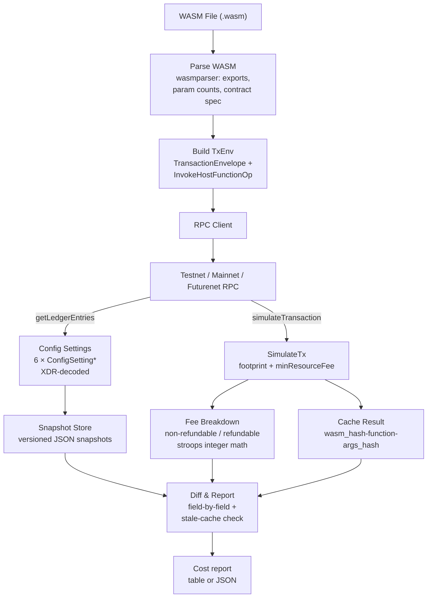

# Architecture

The tool is a five-stage pipeline. The WASM-parsing, fee-breakdown, and
config-snapshot stages are pure computation; the RPC-simulation stage is the
only one that talks to the network.

## 1. WASM parsing

`estimate` starts by reading and validating the compiled `.wasm` file with
`wasmparser`. It records the exported functions, each function's parameter
count, and — when the binary carries a `contractspecv0` section — the typed
parameter lists used by `estimate-all`. The SHA-256 of the WASM bytes is the
identity used for caching. See
[`estimate-all`](commands/estimate-all.md) and
[Caching](concepts/caching.md).

## 2. RPC simulation

The tool constructs a `TransactionEnvelope` containing an
`InvokeHostFunctionOp` — a WASM upload operation when no `--fn` is given, an
invocation of a deployed contract when one is — encodes it to XDR, and calls
`simulateTransaction` on the target network. The response's resource
**footprint** provides the real read/write entry counts and byte sizes, and
the latest-ledger field anchors the result in time. See
[`estimate`](commands/estimate.md).

## 3. Fee breakdown

`minResourceFee` from the simulation is the authoritative total. The tool
derives the **non-refundable** portion independently from the network's own
config-sourced rates (CPU, ledger I/O, bandwidth) using
`(units × rate) / scale` integer stroops math — no floating point — and the
**refundable** portion is the remainder. Every rate comes from a fetched
`ConfigSetting*` entry, never a hardcoded constant. See
[Resource Fees](concepts/resource-fees.md).

## 4. Config snapshotting

`config snapshot` and `config diff` fetch all six `ConfigSetting*` ledger
entries in one batched `getLedgerEntries` call, decode the XDR with
`stellar-xdr` 27.x (big-endian), and store them as versioned JSON snapshots
under `~/.soroban-cost-estimator/snapshots/`. See
[Config Drift](concepts/config-drift.md).

## 5. Config drift detection

Two snapshots are compared field by field. Changed fields are printed with
`💰` for pricing changes and `📋` for non-pricing changes; the exit code is 1
when a pricing change is present. The estimate cache is cross-referenced so
the report names which past estimates are now stale. See
[Config Drift](concepts/config-drift.md) and [Caching](concepts/caching.md).

## Failure modes

- **Misconfigured request**: a simulation that returns no cost data and no
  latest ledger is treated as an error (bad `--id`, wrong network, RPC
  schema drift) — never as a free transaction.
- **Missing fee-rate source**: a `ConfigSetting*` entry that cannot be
  fetched zeroes only its rate and prints a warning naming the source.
- **Negative refundable**: the refundable portion floors at 0 — a simulation
  that omits the fee entirely must not produce an impossible negative
  refundable in the report.

## Design Decisions
- **No Floating Point**: Fee math uses integer stroops math strictly to avoid rounding inconsistencies.
- **Stateless Analysis**: The WASM parsing and fee breakdown are pure computation; only the RPC simulation stage communicates with the network.
